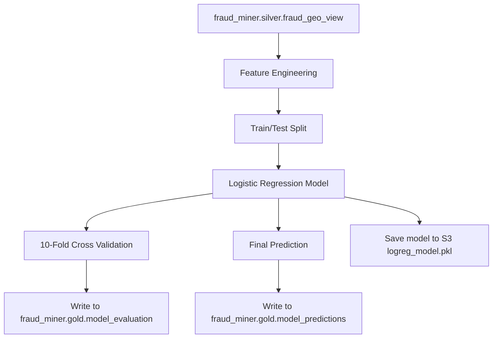

# 🧠 Credit Card Fraud Detection: Logistic Regression Pipeline (Databricks)

---

## 📊 Objective

Train and validate a logistic regression model that detects fraudulent transactions based on card, merchant, and geo-location attributes using the Databricks Lakehouse platform.

---

## 🔁 Data Flow Overview

---

## ✅ Features

- ✅ Feature engineering including `geo_matches_merchant`
- ✅ 10-fold cross-validation with accuracy scores
- ✅ Final model predictions stored in Delta tables
- ✅ Model artifact uploaded to S3 bucket
- ✅ Tables follow Medallion Architecture best practices (`silver` → `gold`)

---

## 🧱 Technologies Used

| Component     | Stack                                |
|---------------|---------------------------------------|
| Language      | Python 3.x                            |
| Platform      | Databricks Notebooks + Spark SQL      |
| ML Library    | scikit-learn                          |
| Storage       | AWS S3                                |
| Format        | Delta Tables, Parquet, Pickle         |

---

## 🚀 Workflow Summary

1. Load data from `fraud_miner.silver.fraud_geo_view`
2. Engineer features for modeling
3. Apply standard scaler & one-hot encoder via `ColumnTransformer`
4. Perform 10-fold cross-validation
5. Train final logistic regression model
6. Save accuracy scores to: `fraud_miner.gold.model_evaluation`
7. Save predictions to: `fraud_miner.gold.model_predictions`
8. Upload final model to S3: `s3://fraud-miner/model/logreg_model.pkl`

---

## 📦 Sample Outputs

### 🧪 Evaluation Scores

| run_date           | fold | accuracy |
|--------------------|------|----------|
| 2025-05-07 01:00:00 | 1    | 0.9812   |
| ...                | ...  | ...      |

### 🔍 Model Predictions

| run_date           | true_label | predicted_label |
|--------------------|------------|-----------------|
| 2025-05-07 01:00:00 | 0          | 0               |
| ...                | ...        | ...             |

---

## 💾 Model Artifact

- Path: `s3://fraud-miner/model/logreg_model.pkl`
- Format: Python pickle (`joblib`)
- Usage: Load via `joblib.load()` for scoring or inspection

---

## 🔮 Next Steps

- 🔁 Compare with other models (Random Forest, XGBoost)
- 🧪 Add SHAP explainability for model interpretation
- 🚀 Register the model using MLflow for deployment
- ⏱ Automate training and scoring with Databricks Jobs or Airflow
- Bug Fixes

---

## 👨‍💻 Author

**Eduardo Francisco da Silva**  
Lead Data Engineer | Fraud Detection | Data Science Practitioner  
🇧🇷 + 🇺🇸 | [LinkedIn](https://www.linkedin.com/in/eduefs)
